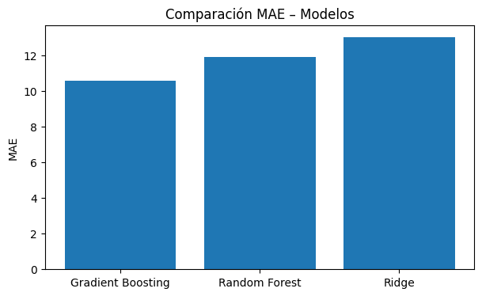

# 📊 Proyecto Final – Machine Learning II  
## 🔧 Predicción de Vida Útil Remanente (RUL) en Motores

**Curso:** Machine Learning II  
**Repositorio:** `sebamarinovic/final_ML2`  
**Tipo de problema:** Aprendizaje supervisado – Regresión  
**Dataset:** NASA C-MAPSS FD001  
**Fecha de presentación:** 20 de enero  
**Autores:** Sebastián Marinovic [y equipo]

---

## 🧠 1. Descripción del proyecto

Este proyecto aborda la predicción de la **Vida Útil Remanente** (*Remaining Useful Life, RUL*) de motores industriales a partir de datos multivariados de sensores.  
El objetivo es estimar cuántos ciclos restan antes de la falla de un motor, apoyando la **toma de decisiones en mantenimiento predictivo** y la planificación operacional.

Se desarrolla un pipeline completo que incluye:

- Análisis Exploratorio de Datos (EDA)
- Preprocesamiento e ingeniería de características
- Entrenamiento y ajuste de múltiples modelos
- Evaluación cuantitativa y visual
- Análisis crítico y propuesta de despliegue

---

## 🔍 2. Dataset y formulación del problema

Se utiliza el dataset **NASA C-MAPSS FD001**, ampliamente validado en la literatura de mantenimiento predictivo.  
Este dataset contiene trayectorias completas de múltiples motores desde estado saludable hasta falla.

- **Entrenamiento:** 20.631 observaciones – 100 motores  
- **Test:** 13.096 observaciones – 100 motores  
- **Variables:** settings operacionales + 21 sensores  
- **Variable objetivo:** RUL (Remaining Useful Life) en ciclos  

⚠️ El RUL está **truncado a un máximo de 125 ciclos**, lo que genera una alta concentración de valores en el rango superior y añade complejidad al problema de regresión.

---

## 📈 3. Análisis exploratorio de datos

### 🔹 Distribución del RUL en entrenamiento


**Interpretación:**  
Se observa una fuerte concentración de observaciones en torno al valor máximo (125), producto del truncamiento del RUL.  
Este comportamiento introduce una asimetría artificial que dificulta la distinción entre motores en estado saludable y aquellos que comienzan su proceso de degradación.

---

## 🧪 4. Modelos implementados

Se entrenaron y compararon tres modelos de regresión supervisada:

| Modelo | Tipo |
|------|------|
| Ridge Regression | Lineal regularizado (baseline) |
| Random Forest Regressor | Ensamble no lineal |
| Gradient Boosting Regressor | Boosting no lineal (modelo ganador) |

El ajuste de hiperparámetros se realizó mediante **Grid Search con validación cruzada**, priorizando el **MAE** como métrica principal debido a su interpretación directa en ciclos de vida útil.

---

## 📊 5. Resultados cuantitativos

### 🔹 Comparación de MAE entre modelos



**Métricas obtenidas en validación:**

| Modelo | MAE | RMSE | R² |
|------|-----|------|----|
| **Gradient Boosting** | **10.57** | **14.01** | **0.887** |
| Random Forest | 11.90 | 15.72 | 0.858 |
| Ridge Regression | 13.01 | 15.74 | 0.858 |

➡️ El modelo **Gradient Boosting** presenta el mejor desempeño global, logrando menor error promedio y mayor capacidad explicativa.

---

## 📉 6. Evaluación visual del modelo ganador

### 🔹 Predicción vs RUL real


**Interpretación:**  
La mayoría de los puntos se alinean con la diagonal, indicando una buena correspondencia entre valores reales y predichos.  
La dispersión aumenta para valores altos de RUL, lo cual es consistente con el truncamiento del target y la mayor incertidumbre en etapas tempranas del ciclo de vida.

---

### 🔹 Distribución de residuos


**Interpretación:**  
Los residuos se distribuyen de forma aproximadamente centrada en cero, sin sesgos sistemáticos evidentes, lo que indica una adecuada calibración global del modelo.

---

## ⚙️ 7. Ingeniería de características

Para capturar la dinámica temporal de degradación, se implementó una estrategia de **ventanas temporales deslizantes**, transformando las series de tiempo en vectores de alta dimensionalidad.

- Muestras finales de entrenamiento: **14.241**
- Muestras de validación: **3.490**
- Features por muestra: **720**

La separación de conjuntos se realizó **por motor**, evitando fuga de información y garantizando una evaluación realista.

---

## 🧠 8. Análisis crítico y limitaciones

- El truncamiento del RUL introduce ruido en valores altos.
- El modelo puede perder precisión bajo condiciones operacionales no vistas.
- El aumento de dimensionalidad implica mayor costo computacional.

El modelo debe ser utilizado como **herramienta de apoyo a la decisión**, complementando el criterio experto.

---

## 🚀 9. Despliegue propuesto

Un sistema de mantenimiento predictivo real podría implementar:

1. Ingestión de sensores en tiempo real  
2. Preprocesamiento automatizado  
3. Predicción periódica del RUL  
4. Dashboard de monitoreo y alertas  

Este flujo permitiría anticipar fallas con un margen útil de decisión.

---

## 🧾 10. Estructura del repositorio

```text
final_ML2/
├── final_ML2.ipynb
├── CMAPSSData.zip
├── README.md
└── figures/
    ├── rul_distribution_train.png
    ├── mae_comparison_models.png
    ├── predicted_vs_actual_rul_gb.png
    └── residuals_distribution_gb.png
```
