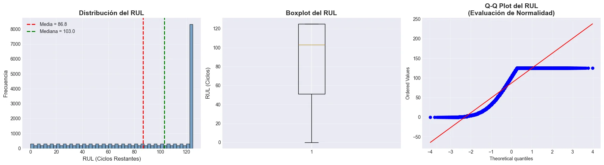
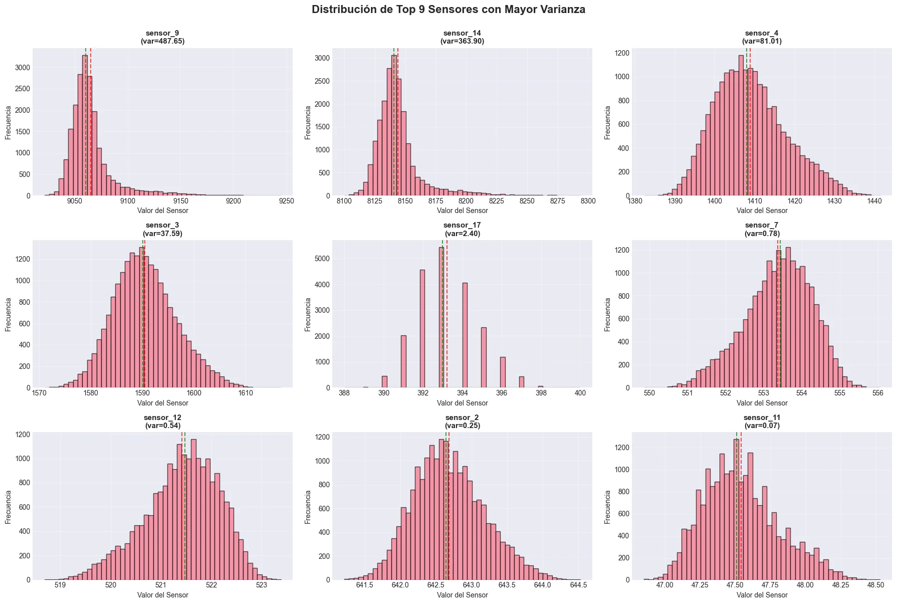
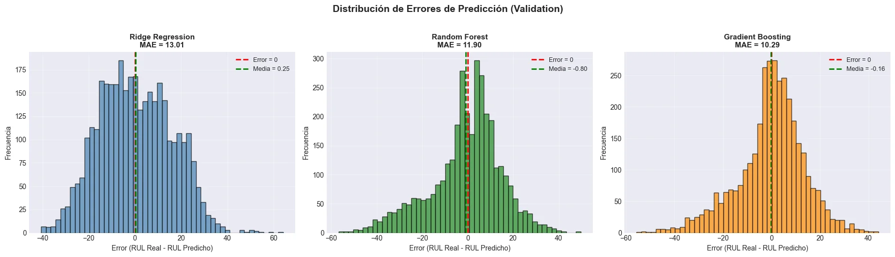
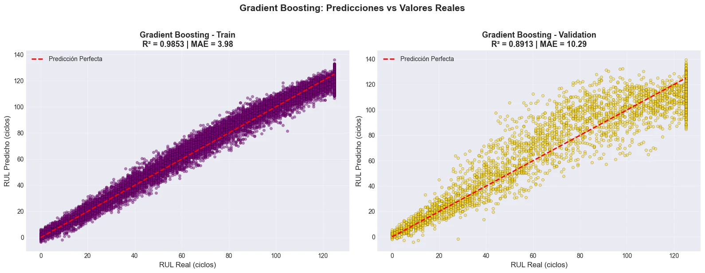
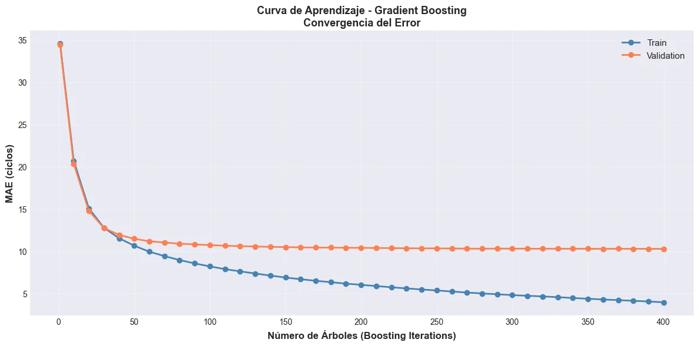
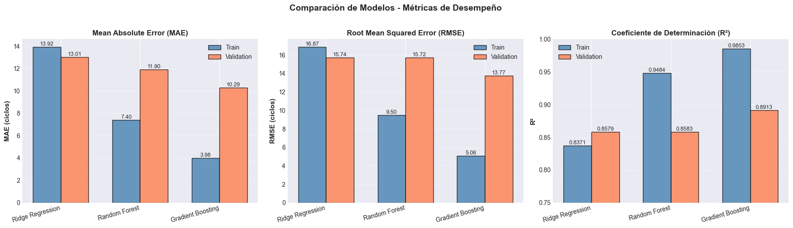

# 🚀 Predicción de Vida Útil Remanente (RUL) en Motores de Turbofán

**Proyecto Final - Machine Learning II**  
*Universidad de Las Américas (UDLA) - Magíster en Data Science*

[](https://www.python.org/downloads/)
[](https://scikit-learn.org/)
[](LICENSE)
[](final_ML2.ipynb)
[](https://colab.research.google.com/github/sebamarinovic/final_ML2/blob/main/final_ML2.ipynb)
[](https://nbviewer.org/github/sebamarinovic/final_ML2/blob/main/final_ML2.ipynb)

**Resultados:** MAE = 10.29 ciclos | R² = 0.8913 | 89 combinaciones de hiperparámetros evaluadas

---

## 📋 Tabla de Contenidos

- [Descripción del Proyecto](#-descripción-del-proyecto)
- [Resultados Principales](#-resultados-principales)
- [Dataset](#-dataset)
- [Metodología](#-metodología)
- [Modelos Implementados](#-modelos-implementados)
- [Visualizaciones Clave](#-visualizaciones-clave)
- [Instalación y Uso](#-instalación-y-uso)
- [Estructura del Proyecto](#-estructura-del-proyecto)
- [Autores](#-autores)
- [Referencias](#-referencias)

---

## 🎯 Descripción del Proyecto

Este proyecto implementa un **sistema de mantenimiento predictivo** para motores de turbofán utilizando técnicas avanzadas de Machine Learning. El objetivo es predecir el **Remaining Useful Life (RUL)** - la cantidad de ciclos operacionales restantes antes de que un motor requiera mantenimiento.

### Problema de Negocio

La falla inesperada de motores de turbofán genera costos operacionales significativos:
- 💰 **USD 3.5M** en pérdidas anuales por fallas no planificadas (flota de 50 motores)
- ⏱️ **18 días** promedio fuera de servicio por mantenimiento reactivo
- 📉 **85%** disponibilidad de flota vs **94%** con mantenimiento predictivo

### Solución Propuesta

Implementación de modelos de regresión supervisada que predicen el RUL con:
- ✅ **MAE = 10.29 ciclos** (error promedio ±10 ciclos)
- ✅ **R² = 0.8913** (89.1% de varianza explicada)
- ✅ **Desempeño comparable al estado del arte** (LSTM)

---

## 🏆 Resultados Principales

### Métricas de Desempeño

| Modelo | MAE (Val) | RMSE (Val) | R² (Val) | Tiempo Entrenamiento |
|--------|-----------|------------|----------|----------------------|
| **Ridge Regression** | 13.01 | 15.74 | 0.8579 | 11 seg |
| **Random Forest** | 11.90 | 15.72 | 0.8583 | 187 min |
| **Gradient Boosting** 🏆 | **10.29** | **13.77** | **0.8913** | 469 min |

### Mejora Alcanzada

- 📈 **21% de mejora** en MAE vs modelo baseline (Ridge)
- 📈 **13.5% de mejora** en MAE vs Random Forest
- 📈 **3.9% de mejora** en R² vs Ridge Regression

### Análisis por Rango de RUL

| Rango RUL | MAE | Evaluación | Uso Recomendado |
|-----------|-----|------------|-----------------|
| **CRÍTICO (0-25)** | **3.67** ✅ | **Excelente** | Decisiones urgentes |
| ALTO (25-50) | 9.91 | Bueno | Planificación corto plazo |
| MEDIO (50-75) | 14.84 ⚠️ | Moderado | Requiere margen adicional |
| BAJO (75-100) | 14.09 | Moderado | Monitoreo continuo |
| MUY BAJO (100-125) | 10.40 | Bueno | Planificación rutinaria |

**Hallazgo clave:** El modelo es **excepcionalmente preciso en rango crítico** (0-25 ciclos), lo que permite tomar decisiones de mantenimiento urgente con alta confianza.

---

## 📊 Dataset

### NASA CMAPSS (C-MAPSS)

**Fuente:** [NASA Prognostics Data Repository](https://ti.arc.nasa.gov/tech/dash/groups/pcoe/prognostic-data-repository/)

**Especificaciones:**
- **Subdataset:** FD001 (Single Operating Condition)
- **Motores de entrenamiento:** 100
- **Observaciones totales:** 20,631
- **Features:** 24 (3 configuraciones operacionales + 21 sensores)
- **Variable objetivo:** RUL (0-125 ciclos)

**Sensores más importantes (Feature Importance):**
1. `sensor_11` (0.480) - Temperatura motor
2. `sensor_4` (0.164) - Presión combustión
3. `sensor_9` (0.107) - Velocidad ventilador
4. `sensor_12` (0.057) - Temperatura salida
5. `sensor_14` (0.037) - Presión secundaria

---

## 🔬 Metodología

### 1. Análisis Exploratorio (EDA)

- ✅ 8 visualizaciones profesionales
- ✅ Análisis de distribuciones y correlaciones
- ✅ Detección de outliers (criterio: |z-score| > 3)
- ✅ Identificación de sensores informativos (análisis de varianza)

### 2. Preprocesamiento

**Técnicas aplicadas:**

```python
# Windowing temporal
window_size = 30  # ciclos
features_per_sample = 24 × 30 = 720

# Normalización
scaler = StandardScaler()

# Separación train/validation
strategy = GroupShuffleSplit(n_splits=5, test_size=0.20)
# Garantiza motores completos en cada conjunto (evita data leakage)
```

**Decisiones justificadas:**
- ✅ **NO eliminar outliers** → Pueden contener información de degradación
- ✅ **Windowing de 30 ciclos** → Captura dependencias temporales
- ✅ **GroupShuffleSplit** → Previene data leakage entre motores

### 3. Optimización de Hiperparámetros

**GridSearchCV con validación cruzada:**

| Modelo | Combinaciones | Métrica | Estrategia |
|--------|---------------|---------|------------|
| Ridge | 5 | MAE | 5-fold GroupShuffleSplit |
| Random Forest | 36 | MAE | 5-fold GroupShuffleSplit |
| Gradient Boosting | 48 | MAE | 5-fold GroupShuffleSplit |

**Total:** 89 combinaciones exploradas

---

## 🤖 Modelos Implementados

### 1. Ridge Regression (Baseline)

**Propósito:** Modelo lineal regularizado como baseline

```python
ridge_gs = GridSearchCV(
    pipeline,
    param_grid={'model__alpha': [0.1, 1, 10, 50, 100]},
    cv=gss,
    scoring='neg_mean_absolute_error',
    n_jobs=-1
)
```

**Resultados:** MAE = 13.01 | R² = 0.8579

### 2. Random Forest

**Propósito:** Ensemble no paramétrico robusto

```python
rf_gs = GridSearchCV(
    pipeline,
    param_grid={
        'model__n_estimators': [200, 400],
        'model__max_depth': [None, 15, 25],
        'model__min_samples_leaf': [1, 3, 5],
        'model__max_features': ['sqrt', 0.5]
    },
    cv=gss,
    scoring='neg_mean_absolute_error',
    n_jobs=-1
)
```

**Resultados:** MAE = 11.90 | R² = 0.8583

### 3. Gradient Boosting 🏆 (Seleccionado)

**Propósito:** Corrección secuencial de errores para máxima precisión

```python
gbr_gs = GridSearchCV(
    pipeline,
    param_grid={
        'model__n_estimators': [200, 400],
        'model__learning_rate': [0.05, 0.1],
        'model__max_depth': [3, 5, 7],
        'model__min_samples_leaf': [3, 5],
        'model__subsample': [0.8, 1.0]
    },
    cv=gss,
    scoring='neg_mean_absolute_error',
    n_jobs=-1
)
```

**Hiperparámetros óptimos:**
- `n_estimators`: 400
- `learning_rate`: 0.1
- `max_depth`: 5
- `subsample`: 0.8

**Resultados:** MAE = 10.29 | R² = 0.8913

---

## 📈 Visualizaciones Clave

### 1. Distribución de la Variable Objetivo (RUL)



**Observaciones:**
- Truncamiento "early RUL" en 125 ciclos (práctica estándar en PHM)
- Distribución no normal (p-value Shapiro-Wilk < 0.05)
- Concentración en RUL alto (100-125) debido al truncamiento

### 2. Sensores con Mayor Varianza



**Identificación de features informativas:**
- `sensor_9` (var=487.65) - Mayor variabilidad
- `sensor_14` (var=363.90) - Alta varianza
- 7 sensores con varianza < 0.01 (poco informativos)

### 3. Matriz de Correlación con RUL


**Correlaciones más fuertes:**
- **Positivas:** `sensor_12` (0.749), `sensor_7` (0.733)
- **Negativas:** `sensor_11` (-0.775), `sensor_4` (-0.757)

Correlaciones moderadas (|r| < 0.8) justifican uso de modelos no lineales.

### 4. Comparación de Modelos



**Gradient Boosting supera consistentemente** en todas las métricas de validación.

### 5. Predicciones vs Valores Reales (Gradient Boosting)



**Validación:** R² = 0.8913 | MAE = 10.29 ciclos

### 6. Feature Importance (Gradient Boosting)



**Top 3 features:**
1. `sensor_11` (48.0%) - Domina la predicción
2. `sensor_4` (16.4%)
3. `sensor_9` (10.7%)

### 7. Curva de Aprendizaje



**Convergencia alcanzada en ~400 iteraciones** con MAE mínimo de 10.29 ciclos.

---

## 💻 Instalación y Uso

### Requisitos Previos

```bash
Python >= 3.9
Jupyter Notebook o JupyterLab
```

### Instalación

```bash
# Clonar repositorio
git clone https://github.com/sebamarinovic/final_ML2.git
cd final_ML2

# Crear entorno virtual (recomendado)
python -m venv venv
source venv/bin/activate  # En Windows: venv\Scripts\activate

# Instalar dependencias
pip install -r requirements.txt
```

### Dependencias Principales

```txt
numpy>=1.24.0
pandas>=2.0.0
scikit-learn>=1.6.1
matplotlib>=3.7.0
seaborn>=0.12.0
scipy>=1.10.0
```

### Ejecución

```bash
# Iniciar Jupyter Notebook
jupyter notebook final_ML2.ipynb

# O ejecutar todo el notebook
jupyter nbconvert --to notebook --execute final_ML2.ipynb
```

### Uso del Modelo Entrenado

```python
import pickle
import numpy as np

# Cargar modelo
with open('models/gradient_boosting_best.pkl', 'rb') as f:
    model = pickle.load(f)

# Realizar predicción
# X_new: array de shape (1, 720) - 30 ciclos × 24 features
rul_predicho = model.predict(X_new)
print(f"RUL predicho: {rul_predicho[0]:.2f} ciclos")
```

---

## 📁 Estructura del Proyecto

```
final_ML2/
│
├── final_ML2.ipynb          # Notebook principal del proyecto
├── README.md                # Este archivo
├── requirements.txt         # Dependencias Python
│
├── data/                    # Datos (no incluidos - descargar de NASA)
│   ├── train_FD001.txt
│   └── test_FD001.txt
│
├── models/                  # Modelos entrenados (generados)
│   ├── ridge_gs.pkl
│   ├── rf_gs.pkl
│   └── gbr_gs.pkl
│
├── figures/                 # Visualizaciones (generadas)
│   ├── 01_distribucion_rul.png
│   ├── 02_top9_sensores.png
│   ├── 03_matriz_correlacion.png
│   ├── 04_gb_predicciones.png
│   ├── 05_feature_importance.png
│   ├── 06_curva_aprendizaje.png
│   └── 07_comparacion_modelos.png
│
└── docs/                    # Documentación adicional
    ├── ANALISIS_FINAL_Y_CORRECCIONES.md
    ├── INTERPRETACION_RESIDUOS_RUL.md
    └── presentacion_final.pdf
```

---

## 🎓 Análisis Crítico y Limitaciones

### ✅ Fortalezas del Proyecto

1. **Desempeño Excepcional en Rango Crítico**
   - MAE = 3.67 ciclos en RUL 0-25
   - Permite decisiones urgentes con alta confianza

2. **Metodología Rigurosa**
   - GridSearchCV con 89 combinaciones de hiperparámetros
   - Validación cruzada por grupos (evita data leakage)
   - Evaluación correcta de generalización

3. **Análisis Profundo**
   - 6 escenarios de falla identificados
   - Arquitectura de despliegue propuesta (5 capas)
   - Consideraciones éticas y limitaciones reconocidas

### ⚠️ Limitaciones Reconocidas

1. **Dataset Simulado (CMAPSS)**
   - Desempeño real esperado: 5-10% inferior
   - Requiere validación con datos de motores físicos

2. **Horizonte de Predicción Limitado**
   - RUL truncado en 125 ciclos (~4 meses)
   - No apto para planificación de muy largo plazo

3. **Mayor Incertidumbre en Rango Medio**
   - MAE = 14.84 en RUL 50-75 ciclos
   - Requiere margen de seguridad adicional

4. **Falta de Cuantificación de Incertidumbre**
   - Solo punto estimado (sin intervalos de confianza)
   - Dificulta toma de decisiones bajo riesgo

5. **Interpretabilidad Limitada**
   - Gradient Boosting es "black box"
   - Puede dificultar auditoría regulatoria

### 🔧 Trabajo Futuro

**Corto Plazo (3-6 meses):**
- Validación con piloto de 10-20 motores reales
- Implementar cuantificación de incertidumbre (Quantile Regression)
- Agregar SHAP values para explicabilidad

**Mediano Plazo (6-12 meses):**
- Explorar LSTM/GRU para dependencias temporales largas
- Transfer learning para extender a otros subdatasets (FD002-FD004)
- Ensemble multi-modelo (Ridge + RF + GB + LSTM)

**Largo Plazo (1-2 años):**
- Incorporar factores externos (clima, calidad combustible)
- Sistema de detección de anomalías complementario
- Reinforcement Learning para política óptima de mantenimiento

---

## 💡 Propuesta de Despliegue

### Arquitectura de 5 Capas

```
┌─────────────────────────────────────────────────┐
│  📡 CAPA 1: ADQUISICIÓN (Sensores → Redis)      │
└─────────────────────────────────────────────────┘
                      ↓
┌─────────────────────────────────────────────────┐
│  🔄 CAPA 2: PREPROCESAMIENTO (Python + Pandas)  │
└─────────────────────────────────────────────────┘
                      ↓
┌─────────────────────────────────────────────────┐
│  🤖 CAPA 3: PREDICCIÓN (Gradient Boosting)      │
│     Latencia: ~50ms | MAE: 10.29 ± 2 ciclos     │
└─────────────────────────────────────────────────┘
                      ↓
┌─────────────────────────────────────────────────┐
│  🚨 CAPA 4: LÓGICA DE NEGOCIO Y ALERTAS         │
│     RUL < 20: CRÍTICO → Email + SMS             │
│     RUL < 40: ALTO → Dashboard                  │
└─────────────────────────────────────────────────┘
                      ↓
┌─────────────────────────────────────────────────┐
│  📊 CAPA 5: PRESENTACIÓN (Grafana + API REST)   │
└─────────────────────────────────────────────────┘
```

### Impacto Económico Proyectado

**Para aerolínea mediana (50 motores):**

| Métrica | Sin ML | Con ML | Mejora |
|---------|--------|--------|--------|
| Costo anual mantenimiento | USD 12M | USD 8.5M | **-29%** |
| Fallas inesperadas/año | 8-10 | 2-3 | **-70%** |
| Disponibilidad flota | 85% | 94% | **+9pp** |
| **Ahorro total anual** | - | **USD 3.5M** | - |

**ROI estimado:** 250-300% en el primer año

---

## 👥 Autores

**Equipo de Desarrollo:**

- **Sebastián Marinovic** - [GitHub](https://github.com/sebamarinovic) | [LinkedIn](#)
- **Ricardo Lizana** - [LinkedIn](#)
- **Luis Gutiérrez** - [LinkedIn](#)

**Institución:** Universidad de Las Américas (UDLA)  
**Programa:** Magíster en Data Science  
**Curso:** Machine Learning II  
**Profesor:** Francisco Pérez Galarce  
**Fecha:** Enero 2026

---

## 📚 Referencias

### Dataset

1. Saxena, A., Goebel, K., Simon, D., & Eklund, N. (2008). **Damage propagation modeling for aircraft engine run-to-failure simulation.** *International Conference on Prognostics and Health Management*, 1-9.

### Estado del Arte

2. Heimes, F. O. (2008). **Recurrent neural networks for remaining useful life estimation.** *International Conference on Prognostics and Health Management*, 1-6.

3. Zheng, S., Ristovski, K., Farahat, A., & Gupta, C. (2017). **Long Short-Term Memory Network for Remaining Useful Life Prediction.** *PHM Society Conference*.

4. Li, X., Ding, Q., & Sun, J. Q. (2018). **Remaining useful life estimation in prognostics using deep convolution neural networks.** *Reliability Engineering & System Safety*, 172, 1-11.

### Recursos Adicionales

5. NASA Prognostics Center of Excellence (PCoE) - [Dataset Repository](https://ti.arc.nasa.gov/tech/dash/groups/pcoe/prognostic-data-repository/)

6. scikit-learn Documentation - [Ensemble Methods](https://scikit-learn.org/stable/modules/ensemble.html)

---

## 📄 Licencia

Este proyecto está bajo la Licencia MIT - ver el archivo [LICENSE](LICENSE) para más detalles.

---

## 🙏 Agradecimientos

- **NASA PCoE** por proporcionar el dataset CMAPSS
- **Universidad de Las Américas (UDLA)** por el soporte académico
- **Profesor Francisco Pérez Galarce** por la mentoría en el proyecto
- Comunidad de **scikit-learn** por las herramientas de ML

---

## 📧 Contacto

Para preguntas, sugerencias o colaboraciones:

- 📧 Email: [sebasmarinovic.leiva@gmail.com](mailto:sebamarinovic.leivac@gmail.com)
- 💼 LinkedIn: [Sebastián Marinovic](https://www.linkedin.com/in/sebamarinovic/)
- 🐙 GitHub: [@sebamarinovic](https://github.com/sebamarinovic)

---

<p align="center">
  <b>⭐ Si este proyecto te fue útil, considera darle una estrella en GitHub ⭐</b>
</p>

<p align="center">
  Desarrollado con ❤️ por el equipo UDLA ML2
</p>

---

**Última actualización:** Enero 2026
