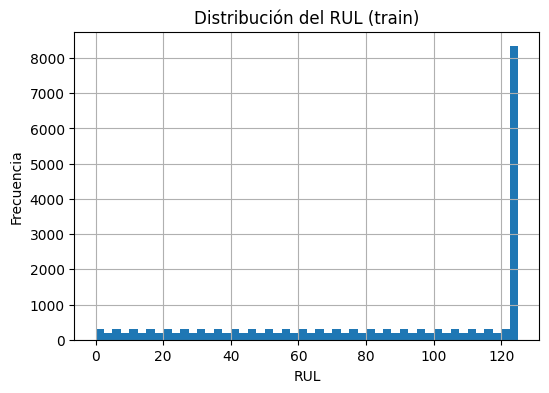
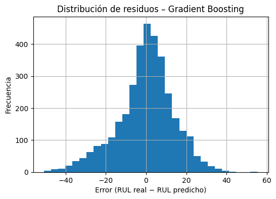

# 📊 Proyecto Final – Machine Learning II  
## 🔧 Predicción de Vida Útil Remanente (RUL) en Motores

**Curso:** Machine Learning II  
**Repositorio:** sebamarinovic/final_ML2  
**Problema:** Regresión supervisada para estimar Remaining Useful Life de motores  
**Dataset:** NASA C-MAPSS FD001  
**Fecha de presentación:** 20 de enero  
**Autores:** Sebastián Marinovic - Luis Gutierrez - Ricardo Lizana

---

## 🧠 1. Descripción del proyecto

Este trabajo aborda el desarrollo de un modelo de Machine Learning para la predicción de la **Vida Útil Remanente (RUL)** de motores industriales a partir de series temporales de sensores.

El objetivo principal es estimar, con un error mínimo, cuántos ciclos restan antes de que un motor falle, apoyando decisiones de **mantenimiento predictivo** y planificación operativa.

Se implementa un pipeline completo que incluye:
- **Análisis exploratorio de datos (EDA)**
- **Preprocesamiento y Feature Engineering**
- **Entrenamiento y ajuste de múltiples modelos**
- **Comparación cuantitativa y visual**
- **Interpretación y propuestas de despliegue**

---

## 🔍 2. Características del dataset

El dataset *NASA C-MAPSS FD001* contiene lecturas multivariadas de sensores y variables de operación para una flota de motores simulados, con su correspondiente RUL:

- ➤ **Entrenamiento:** 20.631 muestras (100 motores)  
- ➤ **Validación/Test:** 13.096 muestras (100 motores)  
- ➤ **Variables:** settings operacionales + 21 sensores  
- ➤ **Target:** RUL por cada ciclo histórico

> ⚠️ El RUL está **truncado a un máximo de 125 ciclos**, creando una fuerte concentración de valores altos y agregando complejidad al modelado.

---

## 📈 3. Análisis exploratorio

### 🔹 Distribución del RUL en entrenamiento

La mayoría de los valores de RUL se agrupan alrededor de 125 debido al truncamiento artificial. Esto significa que el modelo debe aprender tanto regiones "estables" como señales claras de degradación progresiva.

---

## 🧪 4. Modelos implementados

Se compararon tres enfoques principales:

| Modelo                     | Tipo                        |
|---------------------------|-----------------------------|
| Ridge Regression          | Lineal regularizado         |
| Random Forest Regressor   | No lineal / ensamble        |
| Gradient Boosting Regressor | Boosting no lineal       |

El ajuste de hiperparámetros se realizó con validación cruzada (*Grid Search CV*), priorizando el **MAE (Error Absoluto Medio)** por su interpretabilidad en unidades de RUL.

---

## 📊 5. Resultados cuantitativos

### 🔹 Comparación de MAE entre modelos

**Resumen de métricas (validación):**

| Modelo             | MAE     | RMSE    | R²      |
|--------------------|---------|---------|---------|
| Gradient Boosting  | **10.57** | **14.01** | **0.887** |
| Random Forest      | 11.90   | 15.72   | 0.858   |
| Ridge Regression   | 13.01   | 15.74   | 0.858   |

➡️ El modelo **Gradient Boosting** es el mejor en términos de precisión, capacidad explicativa y ajuste general a los datos.

---

## 📉 6. Resultados visuales del modelo ganador

### 📍 Predicción vs RUL real

Este gráfico compara los valores predichos por el modelo con los RUL reales. La línea punteada representa una predicción perfecta. Se observa que la mayoría de puntos se agrupa cerca de la diagonal, lo que indica un buen ajuste global.

---

### 📍 Distribución de residuos

La distribución de errores se centra alrededor de cero, con dispersión moderada, lo cual indica que el modelo no presenta sesgo sistemático y mantiene errores razonables.

---

## ⚙️ 7. Ingeniería de características

Para capturar la dependencia temporal de los sensores, se aplicó una técnica de **ventanas deslizantes** que transformó las series originales en vectores estáticos de características.

Esto permitió a los modelos aprender patrones de degradación basados en el historial reciente de cada motor.

---

## 🧠 8. Discusión, limitaciones y propuestas

### 📍 Análisis crítico

- El truncamiento del RUL agrega ruido en los valores más altos y complica la separación entre “estado saludable” y “inicio de degradación”.
- La alta dimensionalidad de los datos requiere modelos capaces de manejar relaciones no lineales.

### 📍 Limitaciones

- La evaluación no considera condiciones operativas fuera de las simuladas.
- El modelo podría degradar su precisión en situaciones no representadas en el dataset.

### 📍 Despliegue propuesto

Un sistema de mantenimiento predictivo real podría implementar:

1. Pipeline de ingestión de sensores en tiempo real
2. Preprocesamiento automatizado
3. Predicción periódica del RUL
4. Dashboard de monitoreo y alertas

Este flujo permitiría anticipar fallas con un margen útil de decisión.

---

## 🧾 9. Estructura del repositorio

final_ML2/
├── final_ML2.ipynb
├── CMAPSSData.zip
├── README.md
├── rul_distribution_train.png
├── mae_comparison_models.png
├── predicted_vs_actual_rul_gb.png
└── residuals_distribution_gb.png

---

## 🛠️ 10. Cómo reproducir

1. Descomprimir `CMAPSSData.zip` en el mismo directorio
2. Abrir el notebook `final_ML2.ipynb`
3. Ejecutar todas las celdas en orden
4. Revisar la sección de gráficas para verificar exportadas en PNG

---

## 🏁 11. Conclusión

El uso de modelos no lineales, especialmente Gradient Boosting, permite un ajuste preciso de los RUL en datos sintéticos y reales.  
Con un MAE de ≈10.6 ciclos y un R² de 0.887, el modelo presenta una buena capacidad predictiva y estabilidad, lo que lo hace adecuado para aplicaciones de mantenimiento predictivo en ambientes industriales.

---

